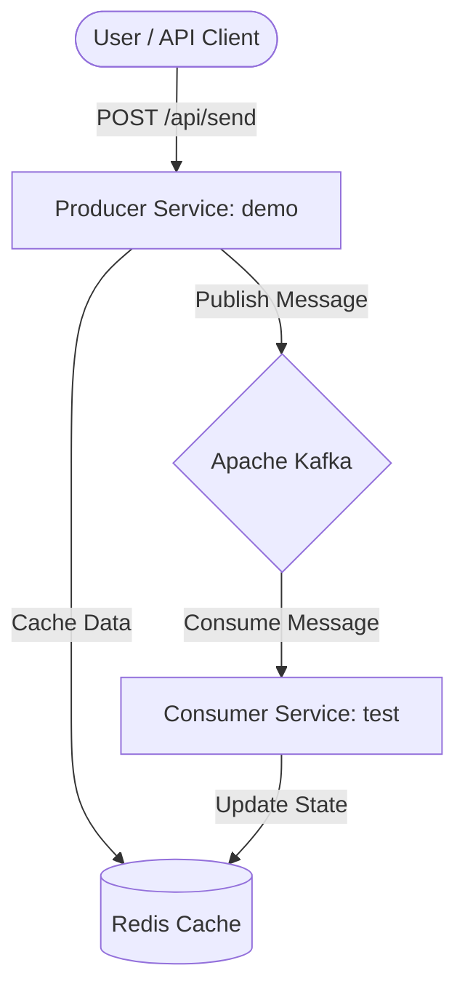

# kafka-communication
This project is a professional-grade Event-Driven Distributed System built with Spring Boot, Apache Kafka, and Redis. It demonstrates core microservices patterns like asynchronous messaging, real-time data processing, and distributed caching.
# Java Microservices: Event-Driven Architecture with Kafka & Redis

[](https://www.oracle.com/java/)
[](https://spring.io/projects/spring-boot)
[](https://kafka.apache.org/)
[](https://redis.io/)
[](https://www.docker.com/)

A professional-grade distributed system demonstrating **Event-Driven Architecture (EDA)**, real-time message processing, and distributed caching using Java, Spring Boot, Kafka, and Redis.

## 🚀 Overview

This project consists of two decoupled microservices that communicate asynchronously via Apache Kafka. It showcases how to build scalable, resilient backend systems capable of handling real-time data streams and maintaining state across distributed components.

- **Producer Service (`demo`)**: Exposes a REST API to ingest messages, publishes events to Kafka, and maintains an initial record in Redis.
- **Consumer Service (`test`)**: Listens to Kafka topics in real-time and updates the global system state in Redis.

## 🏗 Architecture



## 🛠 Tech Stack

*   **Language**: Java 21
*   **Framework**: Spring Boot 3.x / 4.x (Snapshot)
*   **Messaging**: Apache Kafka (Event Steaming)
*   **Caching/Store**: Redis (Distributed State Store)
*   **Build Tool**: Gradle
*   **Containerization**: Docker & Docker Compose
*   **Libraries**: Lombok, Spring Data Redis, Spring Kafka

## 🌟 Key Features

*   **Asynchronous Messaging**: Decoupled service communication via Kafka topics for high availability.
*   **Real-time Processing**: Sub-second latency from message production to consumer processing.
*   **Distributed Caching**: Shared state across services using Redis for improved performance and consistency.
*   **Infrastructure as Code**: Ready-to-go environment with Docker Compose (Kafka, Zookeeper, Redis).
*   **Clean Code Architecture**: Demonstrates best practices in Spring Boot service/controller design, configuration management, and dependency injection.

## 🚦 Getting Started

### Prerequisites
*   Java 21 or higher
*   Docker & Docker Compose
*   Gradle (optional, uses `./gradlew`)

### 1. Start Infrastructure
Spin up Kafka and Redis using Docker Compose from the root directory:
```bash
docker-compose up -d
```

### 2. Run the Services
Open two terminal windows:

**Run Producer:**
```bash
cd demo/demo
./gradlew bootRun
```

**Run Consumer:**
```bash
cd test
./gradlew bootRun
```

### 3. Test the Workflow
Send a test message via POST request:
```bash
curl -X POST "http://localhost:8080/api/send?message=HelloKafka"
```

Check the Consumer logs to see the message being processed and stored in Redis!

---
*Created for portfolio demonstration and skill showcase.*
